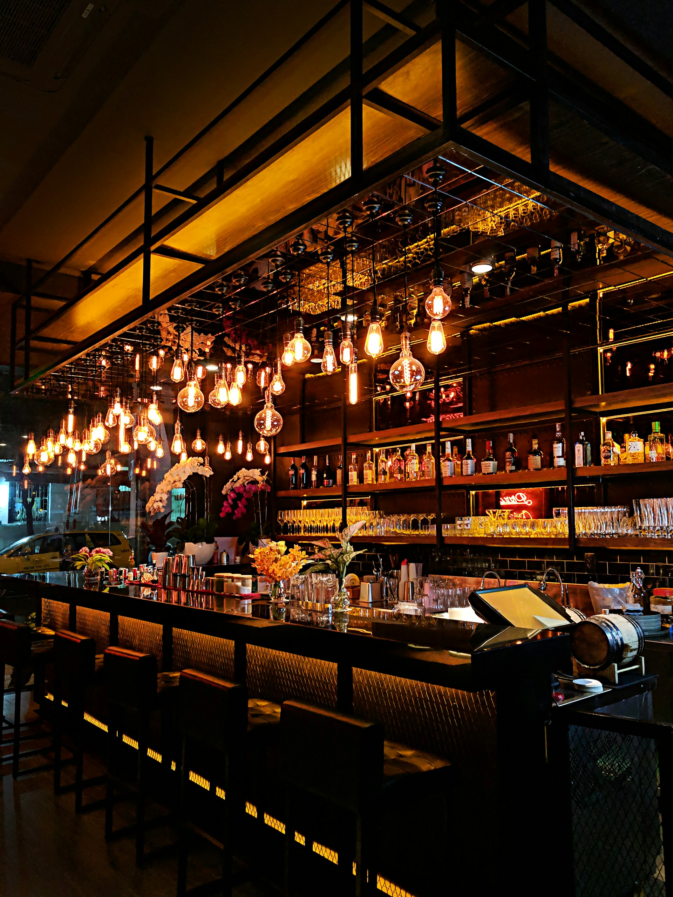

# Action Plan — Eshot Vinos y Licores
**Generado:** 2026-05-15  
**Score actual:** 61 / 100  
**Score objetivo (90 días):** 75 / 100  

---

## CRÍTICO — Esta semana (impacto en local pack y conversiones)

### C1. Verificar y completar Google Business Profile
**Esfuerzo:** 2–4 horas | **Impacto:** +15–25 posiciones en local pack

1. Buscar "Eshot Vinos y Licores Guadalajara" en Google Maps para confirmar el listing
2. Si no está verificado: iniciar verificación via Google Business Profile dashboard
3. Una vez verificado, completar:
   - Categoría primaria: **Licorería** / Secundaria: Servicio de catering
   - Horario: Lun–Dom 09:00–21:00 (igual que schema)
   - Fotos: subir las 6 fotos de galería + logo
   - Descripción: 750 caracteres, incluir "vinos para bodas Guadalajara" y "licores para eventos"
   - Zona de servicio: las 5 municipalidades
   - Habilitar mensajería GBP (además de WhatsApp externo)
4. Agregar URL canónica de GBP al `sameAs` del schema y al footer del sitio

### C2. Iniciar adquisición de reseñas
**Esfuerzo:** 30 min setup + ongoing | **Impacto:** local pack eligibility

- Crear mensaje WhatsApp de seguimiento post-evento (enviar 3–5 días después)
- Incluir link directo a la página de reseñas de GBP
- Meta: 5 reseñas en 30 días → activa display de estrellas
- Responder TODAS las reseñas en <24 horas
- Nunca usar servicios de reseñas de pago

### C3. Comprimir imagen hero (988 KB → ≤180 KB WebP)
**Esfuerzo:** 30 minutos | **Impacto:** LCP mobile -1.0 a -1.5s

```bash
# En el directorio del proyecto
npm install --save-dev sharp
node -e "
const sharp = require('sharp');
sharp('img/hero-bg.jpg').webp({quality:80}).toFile('img/hero-bg.webp', (err, info) => console.log('WebP:', info));
sharp('img/hero-bg.jpg').avif({quality:60}).toFile('img/hero-bg.avif', (err, info) => console.log('AVIF:', info));
"
```

Luego en index.html, reemplazar el `` del hero:
```html
<picture>
  <source srcset="img/hero-bg.avif" type="image/avif" />
  <source srcset="img/hero-bg.webp" type="image/webp" />
  
</picture>
```

También actualizar el `<link rel="preload">` en el head:
```html
<link rel="preload" as="image" href="img/hero-bg.webp"
      type="image/webp" fetchpriority="high" />
```

---

## ALTO — Primeros 7 días

### A1. Listar en directorios de bodas Tier 1
**Esfuerzo:** 2 horas | **Impacto:** backlinks relevantes + AI citations

- bodas.com.mx — crear perfil de proveedor
- matrimonio.com.mx — crear perfil
- Bing Places for Business — listing gratuito (sync con GBP)
- Apple Maps Connect — listing gratuito

Usar exactamente este NAP en todos:
```
Eshot Vinos y Licores
+52 33 2243 0594
Guadalajara, Jalisco, México
https://eshot-vinosylicores.com
```
Escribir descripción única por directorio (no copiar-pegar el mismo texto).

### A2. Agregar H2 con keyword bajo el H1
**Esfuerzo:** 5 minutos | **Archivo:** index.html ~línea 110

Después del `</h1>` del hero, agregar:
```html
<h2 class="text-lg md:text-xl text-gray-400 font-light mb-2">
  Proveedores de vinos y licores para bodas y eventos en Guadalajara
</h2>
```

### A3. Agregar sección FAQ al HTML (8 preguntas mínimo)
**Esfuerzo:** 3–4 horas | **Impacto:** AI citations, long-tail keywords, E-E-A-T

Nueva sección `<section id="faq">` entre Galería y Cobertura. Preguntas prioritarias:

1. ¿Cuántas botellas de vino necesito para una boda de 100 personas?
2. ¿Hacen entregas de vinos y licores en Zapopan y Tlaquepaque?
3. ¿Con cuánta anticipación debo cotizar las bebidas para mi evento?
4. ¿Qué tipos de vinos tienen para XV años?
5. ¿Cuánto cuesta un paquete de vinos para evento en Guadalajara?
6. ¿Trabajan con organizadores de eventos o solo clientes directos?
7. ¿Tienen servicio de bartenders o solo venta de producto?
8. ¿Qué marcas de tequila y mezcal tienen disponibles?

Cada respuesta: 100–150 palabras, respuesta directa en la primera oración, mencionar al menos una ciudad naturalmente.

Agregar schema FAQPage:
```json
<script type="application/ld+json">
{
  "@context": "https://schema.org",
  "@type": "FAQPage",
  "mainEntity": [
    {
      "@type": "Question",
      "name": "¿Cuántas botellas de vino necesito para una boda de 100 personas?",
      "acceptedAnswer": {
        "@type": "Answer",
        "text": "[respuesta completa de 100-150 palabras]"
      }
    }
  ]
}
</script>
```

---

## MEDIO — Primeros 30 días

### M1. Agregar testimonials con detalle de evento
**Esfuerzo:** 2–3 horas | **Impacto:** E-E-A-T Experience, proof social

Nueva sección entre Galería y Cobertura. Formato por testimonio:
```
"[Quote específico sobre el servicio]"
— [Nombre o inicial], [tipo de evento], [ciudad], [año]
Ej: "Entregaron todo puntualmente y el vino estuvo delicioso."
— Daniela R., Boda, Zapopan, 2025
```
Mínimo 4–6 testimonials. Incluir ciudad en cada uno para señal local keyword.

### M2. Convertir todas las imágenes a WebP
**Esfuerzo:** 1 hora | **Impacto:** peso total -55%, LCP general -200ms

```bash
# Script para convertir todas las imágenes
node -e "
const sharp = require('sharp');
const fs = require('fs');
const dirs = ['img', 'img/products', 'img/gallery'];
dirs.forEach(dir => {
  fs.readdirSync(dir).filter(f => /\.(jpg|jpeg|png)$/i.test(f)).forEach(file => {
    const input = dir + '/' + file;
    const output = input.replace(/\.(jpg|jpeg|png)$/i, '.webp');
    sharp(input).webp({quality: 82}).toFile(output, (err, info) => {
      if (!err) console.log(file, '->', (info.size/1024).toFixed(0) + 'KB');
    });
  });
});
"
```

Luego envolver cada `` de galería y productos en `<picture>` con source WebP.

### M3. Agregar favicon completo
**Esfuerzo:** 30 minutos | **Herramienta:** realfavicongenerator.net

Subir logo.png y descargar el paquete completo. Reemplazar en `<head>`:
```html
<link rel="icon" href="/favicon.ico" sizes="32x32" />
<link rel="icon" href="img/logo.svg" type="image/svg+xml" />
<link rel="apple-touch-icon" href="img/apple-touch-icon.png" />
```

### M4. Agregar fundador/equipo en sección Nosotros
**Esfuerzo:** 1 hora | **Impacto:** E-E-A-T Expertise, confianza

Un párrafo (80–100 palabras) con:
- Nombre del fundador
- Background en el sector (años en bebidas para eventos)
- Por qué fundó Eshot
- Foto si disponible (con alt text descriptivo)

### M5. Email de dominio
**Esfuerzo:** 30 minutos | **Impacto:** trust signal E-E-A-T

Crear `contacto@eshot-vinosylicores.com` via el proveedor de hosting del dominio (probablemente Namecheap o GoDaddy si el dominio fue comprado ahí, o via Cloudflare Email Routing si se usa Cloudflare — gratis). Actualizar en footer, schema y llms.txt.

### M6. Agregar link a GBP en footer y sección de contacto
**Esfuerzo:** 10 minutos | **Impacto:** Local SEO, trust

Una vez verificado el GBP:
```html
<a href="[URL completa GBP]" target="_blank" rel="noopener noreferrer"
   class="flex items-center gap-2 text-gray-500 hover:text-teal text-sm transition-colors">
  <svg><!-- icono Google Maps --></svg>
  Ver en Google Maps
</a>
```

---

## BAJO — 30–60 días

### B1. Crear llms-full.txt
**Esfuerzo:** 2 horas | **Impacto:** AI depth indexing

Crear `/home/ivanr/workspace/eshot/llms-full.txt` con:
- Catálogo detallado de productos (variedades, orígenes, rangos de precio)
- Guía de cantidades por tipo de evento y número de invitados
- Proceso de cotización y entrega
- Historia del negocio
- Preguntas frecuentes extendidas (20+ preguntas)

Referenciar desde llms.txt:
```markdown
## Contenido completo
- [Guía completa de productos y servicios](https://eshot-vinosylicores.com/llms-full.txt)
```

### B2. IndexNow via GitHub Action
**Esfuerzo:** 30 minutos | **Impacto:** indexación instantánea en Bing/Yandex

Crear `.github/workflows/indexnow.yml`:
```yaml
name: IndexNow
on:
  push:
    branches: [master]
jobs:
  notify:
    runs-on: ubuntu-latest
    steps:
      - name: Notify IndexNow
        run: |
          curl -X POST "https://api.indexnow.org/IndexNow" \
          -H "Content-Type: application/json" \
          -d '{"host":"eshot-vinosylicores.com","key":"[YOUR_KEY]","urlList":["https://eshot-vinosylicores.com/"]}'
```

### B3. Listar en Tier 2 y Tier 3 de directorios
**Esfuerzo:** 2 horas | **Impacto:** NAP consistency, link building

- zankyou.com.mx, casamientos.com.mx (bodas)
- Facebook Business Page
- Páginas Amarillas MX, HotFrog MX, Cylex MX
- EventosJalisco.com

### B4. Migrar a Cloudflare Pages (headers de seguridad)
**Esfuerzo:** 2 horas | **Impacto:** security headers, posible mejora ligera de CWV

Cloudflare Pages tiene free tier, soporta el mismo workflow de GitHub push, y permite `_headers` file para CSP, X-Frame-Options, etc. El dominio ya apunta a eshot-vinosylicores.com — el cambio es solo en el deploy target.

### B5. AggregateRating schema (cuando existan reseñas)
**Esfuerzo:** 10 minutos | **Impacto:** estrellas en resultados orgánicos

Una vez con 5+ reseñas en GBP verificadas, agregar al schema LocalBusiness:
```json
"aggregateRating": {
  "@type": "AggregateRating",
  "ratingValue": "5.0",
  "reviewCount": "8",
  "bestRating": "5"
}
```
Sincronizar manualmente el número de reseñas cada semana.

---

## Resumen de Impacto Estimado (90 días)

| Acción completada | Score estimado |
|---|---|
| Estado actual | 61/100 |
| + GBP verificado + 10 reseñas | 66/100 |
| + FAQ section + testimonials | 70/100 |
| + Hero WebP + imágenes optimizadas | 72/100 |
| + Directorios de bodas Tier 1 y 2 | 74/100 |
| + AggregateRating + FAQPage schema | 76/100 |
| **Total a 90 días (realista)** | **~75/100** |

---

## Ya Aplicado (2026-05-15)

✅ Removidas todas las menciones de "barra libre" del sitio (11 instancias en 3 archivos)  
✅ AOS CSS non-render-blocking (`media="print" onload`)  
✅ LocalBusiness schema validado: @id #business, logo ImageObject, openingHours array, areaServed Place, coordenadas 5 dec.  
✅ WebSite schema: publisher @id corregido  
✅ llms.txt reescrito: sin barra libre, +FAQ, +RSL-1.0 license  
✅ robots.txt: OAI-SearchBot agregado  
✅ Coverage prose: ciudades específicas en prosa (Zapopan, Tlaquepaque, etc.)
